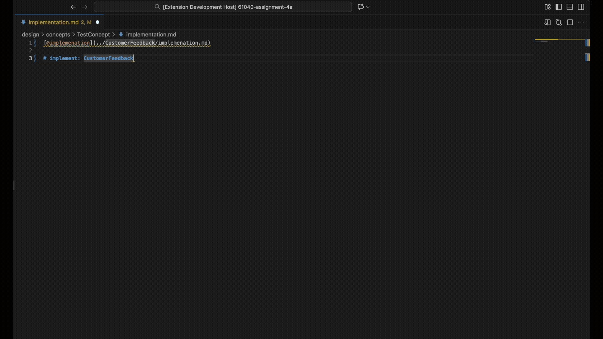

# ctx-tool

Lightweight VS Code extension to **link Markdown files by typing `@` / `!@`** and to **run a `ctx` CLI** on the active Markdown file.

---

## Inspiration
Born from MIT **6.1040 Software Design**, where students work extensively with Markdown files and a custom LLM coding tool called [`context`](https://github.com/61040-fa25/concept_backend) to manage coding workflows and knowledge.

6.1040 centers on **concept-based development** (see [Learning Concepts for Software Design](https://arxiv.org/pdf/2508.14511)), focusing on decomposing software into modular, reusable units—*concepts*—to improve teaching and practice. The course workflow requires constantly linking Markdown files and running the `ctx` CLI tool, which involves tedious manual copying of relative paths and shelling out to commands—this extension minimizes that friction.

## Features

* **`@` & `!@` link completions (Markdown)**

  * Type `@` to see all workspace `*.md` files; keep typing to filter.
  * Inserts a **relative** link from the current document:

    * `@` → `[@filename](path/to/file.md)`
    * `!@` → `` (image-style)


* **Commands**

  * **Ctx: Prompt current Markdown** → `./ctx prompt "<abs/path/to/current.md>"`
  * **Ctx: Save current Markdown** → `./ctx save "<abs/path/to/current.md>"`
  * Runs in the integrated terminal, with `cwd` set to the file’s workspace folder (multi-root friendly).



---

## Installation (dev)

1. Open the project in VS Code
2. `yarn` (or `npm install`)
3. `yarn watch` (or `npm run watch`)
4. Press **F5** to launch the Extension Development Host

> When publishing, add your `"publisher"` to `package.json`.

---

## Activation

* Opens on Markdown files (`onLanguage:markdown`), on **Ctx** commands, or when the workspace contains `**/*.md`.

---

## Usage

**Linking**

1. Open a `.md` file
2. Type `@` (or `!@` for image links)
3. Pick a file → a relative link is inserted

**Running `ctx`**

* Command Palette (`cmd + shift + P`) → run **“Ctx: Prompt current Markdown”** or **“Ctx: Save current Markdown.”**

---

## Required settings (to ensure suggestions appear in Markdown)

Depending on your setup, Markdown suggestions may be subdued. Add this to **Settings (JSON)**:

```json
"[markdown]": {
  "editor.quickSuggestions": true,
  "editor.suggestOnTriggerCharacters": true,
  "editor.quickSuggestionsDelay": 50,

  "editor.wordBasedSuggestions": false,
  "editor.inlineSuggest.enabled": false,
  "editor.snippetSuggestions": "none",

  "editor.suggest.showWords": false,
  "editor.suggest.showSnippets": false,
  "editor.suggest.showClasses": false,
  "editor.suggest.showColors": false,
  "editor.suggest.showConstructors": false,
  "editor.suggest.showConstants": false,
  "editor.suggest.showCustomcolors": false,
  "editor.suggest.showEnums": false,
  "editor.suggest.showEnumMembers": false,
  "editor.suggest.showEvents": false,
  "editor.suggest.showFields": false,
  "editor.suggest.showFiles": true,
  "editor.suggest.showFolders": false,
  "editor.suggest.showFunctions": false,
  "editor.suggest.showInterfaces": false,
  "editor.suggest.showIssues": false,
  "editor.suggest.showKeywords": false,
  "editor.suggest.showMethods": false,
  "editor.suggest.showModules": false,
  "editor.suggest.showOperators": false,
  "editor.suggest.showProperties": false,
  "editor.suggest.showReferences": false,
  "editor.suggest.showStructs": false,
  "editor.suggest.showTypeParameters": false,
  "editor.suggest.showUnits": false,
  "editor.suggest.showUsers": false,
  "editor.suggest.showValues": false,
  "editor.suggestSelection": "first"
},
"markdown.suggest.paths.enabled": false
```

> **Note:** The *only* setting strictly required for Markdown suggestions to work is  
> `"editor.quickSuggestions": true`  
> in the `[markdown]` section.

However, enabling just `editor.quickSuggestions` causes the suggestion popup to show *many* non-Markdown, irrelevant suggestions (like code completions, keywords, classes, etc.).  
That is why we recommend **turning off all the other suggestion item types** (setting them to `false`) to keep suggestion lists focused and uncluttered for Markdown writing.


**macOS tip:** if Ctrl+Space triggers macOS input switching, use **Edit → Trigger Suggest** or rebind “Trigger Suggest” in VS Code.

---

## Commands (from `package.json`)

* `ctx-tool.ctxPrompt` — Ctx: Prompt current Markdown
* `ctx-tool.ctxSave` — Ctx: Save current Markdown

---

## Notes

* Link paths are computed **relative to the current document** (portable if you move folders together).
* In unsaved Markdown buffers, the extension falls back to a workspace-relative path for suggestions.
